# Tensorflow calibrator
Tensorflow camera calibrator

## Prerequisites

```bash
sudo pip3 install numpy, scipy, tensorflow_gpu
```

The example data is collected using my Logitech C 310 webcam.

After 10 epochs we reach precision < 10<sup>-2</sup> size of the quare (~7cm)

## Theory

### Pinhole camera
Our goal is to find the camera matrix K together with distortion coefficients, the so-called intrinsic parameters of the camera.

The camera matrix reads:
<p align="center">
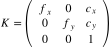 
 </p>
 
where f<sub>x</sub>, f<sub>y</sub> are focal lengths of the camera and c<sub>x</sub>, c<sub>y</sub> are the pixel coordinates of the principal point.

The distortion coefficients depend on the model. Currently we have implemented only simple radial distortion coefficients k<sub>1</sub>, k<sub>2</sub>, k<sub>3</sub> from <a href="https://docs.opencv.org/3.4.3/dc/dbb/tutorial_py_calibration.html">OpenCV docs</a>. 

The world coordinates (x<sub>1</sub>,x<sub>2</sub>,x<sub>3</sub>) in the camera coordinate system are related to the pixel coordinates  (&xi;<sub>1</sub>,&xi;<sub>2</sub>,1) via the camera matrix as follows:

<p align="center">
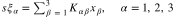 
</p>

with a scale parameter s, which corresponds to the arbitrary scale due to the fact that the camera projects an entire ray to a single point.

The inverse of this relation looks as follows:
<p align="center">
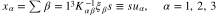      (1)
</p>

The vectors u<sup>i</sup> define the ray corresponding to the i-th point.

### Minimization

Let c<sup>i</sup><sub>&alpha;</sub> be the coordinates of a calibration pattern in its own coordinate system. Here and further the latin index i runs from 1 to N, where N is the number of points in the calibration pattern. Greek indices &alpha;,&beta;... run from 1 to 3. Note that we do not assume anything about the structure of the calibration pattern.

Now, let &xi;<sup>i</sup><sub>&alpha;</sub> be the pixel coordinates of the ith pattern point on the image.

Assuming the camera intrinsic parameters are known we can find a rotation matrix R and a translation vector T which, together with the scale parameters s<sup>i</sup>,  minimize the following error:

<p align="center">
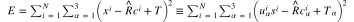
</p>

The quantities *u* are defined in (1). We equipped the variables from the previous section with additional index i, which indicates the number of the point in the calibration pattern.

Indeed, sequientially taking the derrivatives of *E* by *s<sup>i</sup>*, *T*, and *R* and equaling them to zero we obtain the following expressions for (1):
<p align="center">
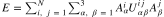  (2)
</p>

Here we defined the following auxilliary quantities:

The projector alogn u<sup>i</sup>
<p align="center">
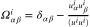,  
</p>

The projection of the rotated vector Rc<sup>i</sup> on the line u<sup>i</sup>

<p align="center">
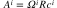, 
</p>

The sum of projectors and its inverse:

<p align="center">
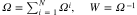,  
</p>

With this notations the matrix *U* looks:

<p align="center">
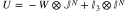,        (3)
</p>

where *J* <sup>N</sup> is NxN all-one matrix matrix and *I* 's are identity matrices of the corresponding dimensions.

The definition (3) in the operator notations reads:


<p align="center">
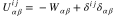,
</p>


The rotation matrix is determined from the following equation:

<p align="center">
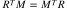  (4)
</p>

where the matrix M reads:

<p align="center">
  
</p>

To summarize, the algorithm for determining the parameters *K* is the following:

1. Initialize K
2. For each image 
   1. Solve the equation (4) with respectto R subject to R<sup>T</sup>R = I
   2. Apply gradients descent to parameters *K* with loss function (2)

Note that the parameters *K* are hidden in the vectors *u*.

